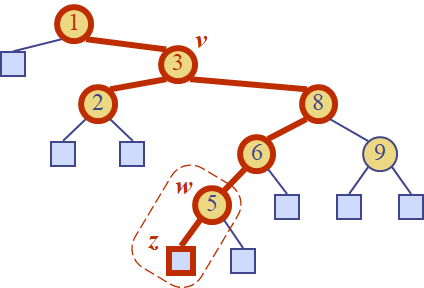
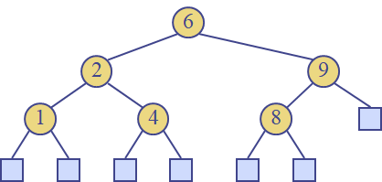

# Week 12 Lab Session document

## Exercise 1: Binary Search Trees

Insert the entries (1,A), (2,B), (3,C), (4,D), and (5,E), in this order,
into an initially empty binary search tree. What will it look like?

## Exercise 2: Binary Search Trees

Insert, into an empty binary search tree, entries with keys 30, 40, 24,
58, 48, 26, 11, 13 (in this order). Draw the tree after each insertion.

For example:

```
Step 1:
30

Step 2
30
\
40

Step 3
30
/ \
24 40
```

And so on.

## Exercise 3

Draw the binary search trees that can store the keys {1,2,3}? Hint: draw
all trees with root 1, then, root 2, then root 3.

## Exercise 4

To delete a node that has two children ( for example to
delete node with key 3, we perform the following steps:



a)  we find the internal node **w** that follows **v** in an inorder
    traversal

b)  we copy key(w) into node v

c)  we remove node w and its left child z (which must be a leaf, why?)
    by means of operation removeExternal(z)

Explain why the left child z is a leaf? Hint: assume that is not a leaf.

## Exercise 5

In the main method of TreeMap.java class from Lesson11Examples, create a
binary search tree with integer keys and String values. Search for a
key. Display the values in increasing order by keys.

## Exercise 6

In the main method of TreeMap.java class from
Lesson11Examples , create the binary search tree from slide 16:



Perform the following operations:

a.  remove 4

b.  insert 4

c.  insert 5

d.  remove 4

e.  find the predecessor of a position
